# <div align="center"> P2P Knowledge Hub </div>

 <div align="center">

[](https://www.python.org/)

[](https://fastapi.tiangolo.com/)
[](https://www.postgresql.org/)
[](https://www.trychroma.com/)
[](https://huggingface.co/)
[](https://ollama.com/)
[](LICENSE)
</div>

<div>

<!-- toc -->

- [P2P Knowledge Hub](#p2p-knowledge-hub)
    * [Why this project](#why-this-project)
    * [Current architecture](#current-architecture)
    * [RAG pipeline](#rag-pipeline)
        + [Ingestion](#ingestion)
        + [Retrieval](#retrieval)
        + [Generation and citations](#generation-and-citations)
    * [API](#api)
        + [`POST /documents`](#post-documents)
        + [`POST /query`](#post-query)
    * [Observability and latency](#observability-and-latency)
    * [Technology](#technology)
    * [Design principles](#design-principles)
    * [Current scope](#current-scope)
    * [Project status](#project-status)

<!-- tocstop -->

</div>

# P2P Knowledge Hub

A production-oriented Retrieval-Augmented Generation (RAG) system for Procure-to-Pay (P2P) knowledge. The project is designed to answer SOP, policy, invoice, purchasing, supplier, and payment questions from enterprise documents with grounded citations.

## Why this project

P2P teams often search across long SOPs and process guides to answer operational questions. P2P Knowledge Hub turns those documents into a searchable knowledge system while keeping retrieval, generation, metadata, citations, and observability explicit and debuggable.

The project intentionally avoids hiding the core RAG pipeline behind large orchestration frameworks. Retrieval, indexing, reranking, generation, persistence, and API layers are implemented as separate components so their behavior can be measured and changed independently.

## Current architecture

```mermaid
flowchart LR

    %% =========================
    %% LEFT: INGESTION PIPELINE
    %% =========================
    subgraph INGEST["📄 Document Ingestion"]
        direction TB

        Upload["POST /documents"]
        Meta["Metadata + SHA-256"]
        Loader["Format-Specific Loader"]
        Chunker["Recursive Chunking"]
        Embed["SentenceTransformer Embeddings"]

        Upload --> Meta
        Meta --> Loader
        Loader --> Chunker
        Chunker --> Embed
    end


    %% =========================
    %% CENTER: STORAGE / METADATA
    %% =========================
    subgraph STORE["🗄️ Persistence Layer"]
        direction TB

        PG[("PostgreSQL<br/>Document Metadata")]
        Chroma[("ChromaDB<br/>Chunk Text + Metadata + Vectors")]
        BM25Index["In-Memory BM25 Index"]

        Chroma -->|"Rebuild lexical corpus"| BM25Index
    end


    %% =========================
    %% RIGHT: QUERY PIPELINE
    %% =========================
    subgraph QUERY["🔍 Query / RAG Pipeline"]
        direction TB

        Query["POST /query"]

        BM25["BM25 Retriever"]
        Dense["Dense Retriever"]

        Hybrid["Hybrid Fusion / RRF"]
        Rerank["Cross-Encoder Reranker"]
        TopK["Top-k Context"]
        Context["GenerationContext"]
        Ollama["Ollama / Qwen3"]
        Citation["Python Citation Resolver"]
        Result["FastAPI GenerationResult"]

        Query --> BM25
        Query --> Dense

        BM25 --> Hybrid
        Dense --> Hybrid

        Hybrid --> Rerank
        Rerank --> TopK
        TopK --> Context
        Context --> Ollama
        Ollama --> Citation
        Citation --> Result
    end


    %% =========================
    %% LEFT → CENTER
    %% =========================

    Meta -->|"Persist document metadata"| PG
    Embed -->|"Store chunks + vectors"| Chroma


    %% =========================
    %% CENTER → RIGHT
    %% =========================

    BM25Index --> BM25
    Chroma -->|"Vector search"| Dense

    TopK -->|"document_id"| PG
    PG -->|"Citation metadata"| Context


    %% =========================
    %% STYLES
    %% =========================

    classDef ingestion fill:#fff3e0,stroke:#e65100,stroke-width:2px,color:#bf360c
    classDef storage fill:#e3f2fd,stroke:#1565c0,stroke-width:2px,color:#0d47a1
    classDef retrieval fill:#f3e5f5,stroke:#6a1b9a,stroke-width:2px,color:#4a148c
    classDef serving fill:#e8f5e9,stroke:#2e7d32,stroke-width:2px,color:#1b5e20,font-weight:bold

    class Upload,Meta,Loader,Chunker,Embed ingestion
    class PG,Chroma,BM25Index storage
    class Query,BM25,Dense,Hybrid,Rerank,TopK,Context,Citation retrieval
    class Ollama,Result serving

```



## RAG pipeline

### Ingestion

The ingestion pipeline currently supports format-specific document loaders without adopting a large document-processing framework.

1. Receive document and business metadata.
2. Persist the uploaded file.
3. Compute an incremental SHA-256 hash.
4. Reject duplicate documents using `source_system + business_process + file_hash`.
5. Extract document content.
6. Split content into `DocumentChunk` objects.
7. Generate SentenceTransformer embeddings.
8. Persist embeddings, chunk text, IDs, and chunk metadata in ChromaDB.

PostgreSQL stores document-level metadata separately.

### Retrieval

The query pipeline uses hybrid retrieval:

```text
Query
  |
  +--> BM25 lexical retrieval
  |
  +--> SentenceTransformer dense retrieval
              |
              v
        Hybrid candidates
              |
              v
     Cross-Encoder reranker
              |
              v
         Top-k chunks
```

BM25 is intentionally kept in memory for the current small corpus. Its index is reconstructed from persisted ChromaDB chunks at application startup and refreshed after successful ingestion.

### Generation and citations

Reranked chunks are converted into generation contexts containing source metadata. The local Ollama generator receives numbered contexts such as `[Source 1]`.

The LLM is responsible for grounded answer synthesis and emitting source references. Citation resolution itself is deterministic Python logic: referenced source numbers are mapped back to their corresponding chunk IDs and document metadata.

A citation can contain:

- source ID
- chunk ID
- document name
- page number
- section
- title
- source URI

This keeps citation metadata outside the model's control.

## API

The current FastAPI application exposes two primary operations:

### `POST /documents`

Uploads and indexes a document together with its P2P metadata.

### `POST /query`

Runs retrieval, reranking, generation, and citation resolution and returns a structured generation result.

Expensive/shared RAG dependencies are created during FastAPI lifespan startup and accessed through dependency injection rather than being reconstructed for every request.

## Observability and latency

A reusable timing decorator based on `time.perf_counter()` records latency for important pipeline stages, including:

- retrieval
- Cross-Encoder reranking
- metadata lookup
- context construction
- Ollama generation
- complete RAG requests

Profiling showed that retrieval and reranking were not the primary latency bottleneck. Ollama generation dominated request time. Further inspection using Ollama's prompt/evaluation metrics showed that Qwen3 thinking tokens were consuming much of the generation budget.

For the current RAG synthesis workload, thinking is disabled and generation length is bounded. This reduced local generation latency substantially while keeping retrieval and citation behavior unchanged.

These numbers are local development observations, not production benchmarks.

## Technology

| Area                           | Technology                  |
| ------------------------------ | --------------------------- |
| Language                       | Python                      |
| API                            | FastAPI                     |
| Validation / settings          | Pydantic, pydantic-settings |
| Document metadata              | PostgreSQL, SQLAlchemy      |
| Dense embeddings               | SentenceTransformers        |
| Vector storage                 | ChromaDB                    |
| Lexical retrieval              | BM25 (`rank_bm25`)          |
| Reranking                      | Cross-Encoder               |
| Generation                     | Ollama / Qwen3              |
| Package/environment management | uv                          |
| Logging                        | Python logging / Rich       |

## Design principles

The current implementation follows several deliberate constraints:

- Keep ingestion and retrieval components replaceable.
- Keep BM25 independent from ChromaDB.
- Treat vector and lexical stores as retrieval infrastructure rather than mixing their logic with chunking.
- Prefer explicit Python citation resolution over asking the LLM to construct citation metadata.
- Measure bottlenecks before optimizing.
- Prefer simple V1 implementations and defer scale-driven complexity.
- Use interfaces for embeddings, vector stores, and retrievers where alternative implementations are expected.

Detailed architectural decisions are documented in [`decisions.md`](decisions.md).

## Current scope

This is an actively developed portfolio project. The current implementation includes the core end-to-end RAG path from document ingestion through API-based grounded generation.

Planned work includes:

- retrieval and generation evaluation
- automated tests for critical pipeline behavior
- stronger document lifecycle/version handling
- containerized deployment
- architecture and operational documentation
- evaluation of incremental BM25 updates when corpus size justifies them
- a canonical chunk store if scale/operational requirements make ChromaDB unsuitable as the persisted chunk-content source

## Project status

The project is currently suitable for local end-to-end experimentation. It is not presented as a finished production deployment. The emphasis is on production-oriented architecture, measurable retrieval/generation behavior, and engineering decisions that can evolve as corpus size and operational requirements increase.
