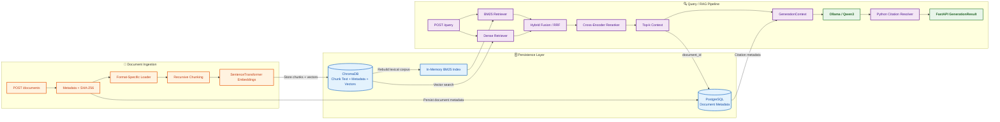

```mermaid
flowchart LR

    %% =========================
    %% LEFT: INGESTION PIPELINE
    %% =========================
    subgraph INGEST["📄 Document Ingestion"]
        direction TB

        Upload["POST /documents"]
        Meta["Metadata + SHA-256"]
        Loader["Format-Specific Loader"]
        Chunker["Recursive Chunking"]
        Embed["SentenceTransformer Embeddings"]

        Upload --> Meta
        Meta --> Loader
        Loader --> Chunker
        Chunker --> Embed
    end


    %% =========================
    %% CENTER: STORAGE / METADATA
    %% =========================
    subgraph STORE["🗄️ Persistence Layer"]
        direction TB

        PG[("PostgreSQL<br/>Document Metadata")]
        Chroma[("ChromaDB<br/>Chunk Text + Metadata + Vectors")]
        BM25Index["In-Memory BM25 Index"]

        Chroma -->|"Rebuild lexical corpus"| BM25Index
    end


    %% =========================
    %% RIGHT: QUERY PIPELINE
    %% =========================
    subgraph QUERY["🔍 Query / RAG Pipeline"]
        direction TB

        Query["POST /query"]

        BM25["BM25 Retriever"]
        Dense["Dense Retriever"]

        Hybrid["Hybrid Fusion / RRF"]
        Rerank["Cross-Encoder Reranker"]
        TopK["Top-k Context"]
        Context["GenerationContext"]
        Ollama["Ollama / Qwen3"]
        Citation["Python Citation Resolver"]
        Result["FastAPI GenerationResult"]

        Query --> BM25
        Query --> Dense

        BM25 --> Hybrid
        Dense --> Hybrid

        Hybrid --> Rerank
        Rerank --> TopK
        TopK --> Context
        Context --> Ollama
        Ollama --> Citation
        Citation --> Result
    end


    %% =========================
    %% LEFT → CENTER
    %% =========================

    Meta -->|"Persist document metadata"| PG
    Embed -->|"Store chunks + vectors"| Chroma


    %% =========================
    %% CENTER → RIGHT
    %% =========================

    BM25Index --> BM25
    Chroma -->|"Vector search"| Dense

    TopK -->|"document_id"| PG
    PG -->|"Citation metadata"| Context


    %% =========================
    %% STYLES
    %% =========================

    classDef ingestion fill:#fff3e0,stroke:#e65100,stroke-width:2px,color:#bf360c
    classDef storage fill:#e3f2fd,stroke:#1565c0,stroke-width:2px,color:#0d47a1
    classDef retrieval fill:#f3e5f5,stroke:#6a1b9a,stroke-width:2px,color:#4a148c
    classDef serving fill:#e8f5e9,stroke:#2e7d32,stroke-width:2px,color:#1b5e20,font-weight:bold

    class Upload,Meta,Loader,Chunker,Embed ingestion
    class PG,Chroma,BM25Index storage
    class Query,BM25,Dense,Hybrid,Rerank,TopK,Context,Citation retrieval
    class Ollama,Result serving
```
